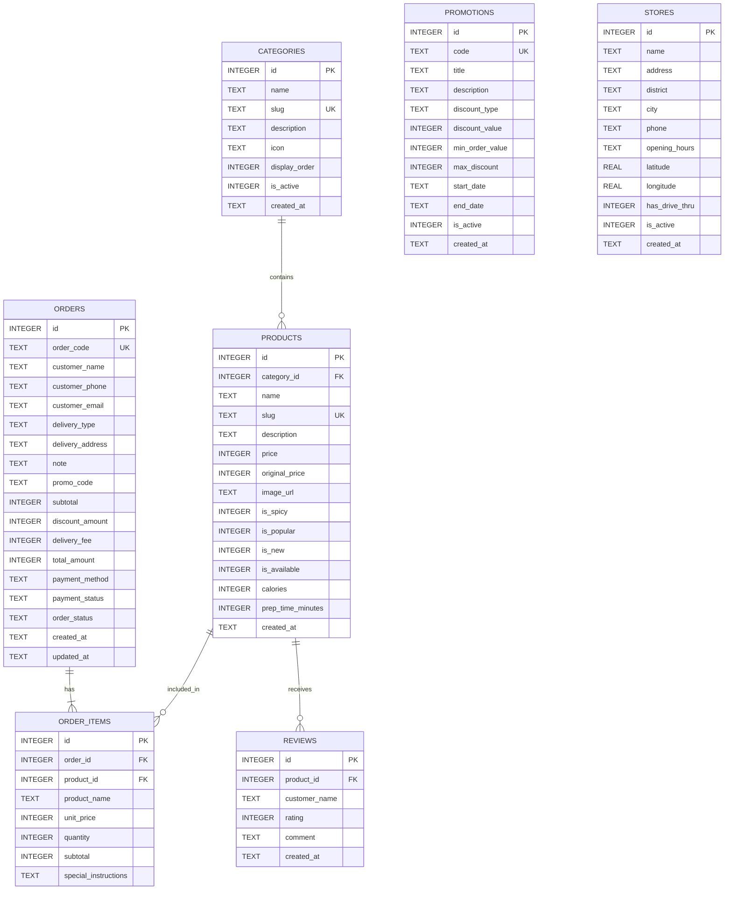

# LƯỢC ĐỒ CƠ SỞ DỮ LIỆU KFC (DATABASE SCHEMA SPECIFICATION)

Tài liệu này đặc tả chi tiết kiến trúc Cơ sở dữ liệu quan hệ (Relational Database) cho hệ thống **KFC Landing Page & Online Ordering System**, triển khai trên nền tảng **SQLite**.

---

## 1. SƠ ĐỒ THỰC THỂ QUAN HỆ (ENTITY-RELATIONSHIP DIAGRAM)



---

## 2. TỪ ĐIỂN DỮ LIỆU CHI TIẾT (DATA DICTIONARY)

### 2.1. Bảng `categories` (Danh mục món ăn)
Lưu trữ các nhóm thực đơn của KFC (Gà Rán, Burger, Combo, Nước uống...).

| Tên Cột | Kiểu Dữ Liệu | Ràng Buộc | Ý Nghĩa & Mô Tả |
|---|---|---|---|
| `id` | INTEGER | PRIMARY KEY AUTOINCREMENT | Khóa chính tự tăng |
| `name` | TEXT | NOT NULL | Tên hiển thị danh mục (VD: "Gà Rán & Gà Quay") |
| `slug` | TEXT | NOT NULL UNIQUE | Đường dẫn thân thiện URL (VD: "ga-ran-ga-quay") |
| `description` | TEXT | NULL | Mô tả chi tiết danh mục |
| `icon` | TEXT | NULL | Biểu tượng hoặc tên icon Lucide đại diện |
| `display_order`| INTEGER | DEFAULT 0 | Thứ tự sắp xếp hiển thị trên giao diện |
| `is_active` | INTEGER | DEFAULT 1 | 1: Đang hiển thị, 0: Ẩn |
| `created_at` | TEXT | DEFAULT CURRENT_TIMESTAMP | Thời gian tạo |

---

### 2.2. Bảng `products` (Danh sách món ăn & combo)
Lưu trữ thông tin chi tiết từng món ăn trong thực đơn KFC.

| Tên Cột | Kiểu Dữ Liệu | Ràng Buộc | Ý Nghĩa & Mô Tả |
|---|---|---|---|
| `id` | INTEGER | PRIMARY KEY AUTOINCREMENT | Khóa chính tự tăng |
| `category_id` | INTEGER | NOT NULL, REFERENCES categories(id) | Khóa ngoại trỏ đến bảng danh mục |
| `name` | TEXT | NOT NULL | Tên món ăn (VD: "Gà Giòn Cay - 2 Miếng") |
| `slug` | TEXT | NOT NULL UNIQUE | Định danh duy nhất theo slug |
| `description` | TEXT | NULL | Mô tả hương vị, nguyên liệu |
| `price` | INTEGER | NOT NULL | Giá bán hiện tại (đơn vị: VNĐ) |
| `original_price`| INTEGER | NULL | Giá gốc trước giảm giá (để gạch ngang hiển thị sale) |
| `image_url` | TEXT | NOT NULL | Đường dẫn hình ảnh chất lượng cao của món ăn |
| `is_spicy` | INTEGER | DEFAULT 0 | 1: Món cay (hiển thị icon ớt), 0: Không cay |
| `is_popular` | INTEGER | DEFAULT 0 | 1: Món bán chạy nhất (Best seller) |
| `is_new` | INTEGER | DEFAULT 0 | 1: Món mới ra mắt |
| `is_available`| INTEGER | DEFAULT 1 | 1: Còn hàng phục vụ, 0: Hết hàng tạm thời |
| `calories` | INTEGER | NULL | Năng lượng ước tính (Kcal) |
| `prep_time_minutes` | INTEGER | DEFAULT 15 | Thời gian chế biến ước tính (phút) |
| `created_at` | TEXT | DEFAULT CURRENT_TIMESTAMP | Thời gian tạo |

---

### 2.3. Bảng `promotions` (Mã giảm giá & Chương trình khuyến mãi)
Quản lý các voucher khuyến mãi áp dụng khi thanh toán.

| Tên Cột | Kiểu Dữ Liệu | Ràng Buộc | Ý Nghĩa & Mô Tả |
|---|---|---|---|
| `id` | INTEGER | PRIMARY KEY AUTOINCREMENT | Khóa chính tự tăng |
| `code` | TEXT | NOT NULL UNIQUE | Mã coupon (VD: `KFCFREESHIP`, `GIAM20K`) |
| `title` | TEXT | NOT NULL | Tên chương trình ưu đãi |
| `description` | TEXT | NULL | Mô tả điều kiện áp dụng |
| `discount_type` | TEXT | NOT NULL CHECK (discount_type IN ('percent', 'fixed')) | Loại giảm giá: `percent` (%) hoặc `fixed` (tiền mặt) |
| `discount_value`| INTEGER | NOT NULL | Mức giảm (VD: 20 đối với 20%, hoặc 20000 đối với 20.000đ) |
| `min_order_value`| INTEGER | DEFAULT 0 | Giá trị đơn hàng tối thiểu để được áp dụng (VNĐ) |
| `max_discount` | INTEGER | NULL | Mức giảm tối đa (VNĐ, áp dụng khi type là 'percent') |
| `start_date` | TEXT | NULL | Ngày bắt đầu áp dụng |
| `end_date` | TEXT | NULL | Ngày hết hạn |
| `is_active` | INTEGER | DEFAULT 1 | 1: Đang áp dụng, 0: Đã vô hiệu hóa |
| `created_at` | TEXT | DEFAULT CURRENT_TIMESTAMP | Thời gian tạo |

---

### 2.4. Bảng `stores` (Hệ thống cửa hàng & Chi nhánh)
Lưu trữ danh sách các nhà hàng KFC trên toàn quốc để hỗ trợ tìm kiếm chi nhánh.

| Tên Cột | Kiểu Dữ Liệu | Ràng Buộc | Ý Nghĩa & Mô Tả |
|---|---|---|---|
| `id` | INTEGER | PRIMARY KEY AUTOINCREMENT | Khóa chính tự tăng |
| `name` | TEXT | NOT NULL | Tên cửa hàng (VD: "KFC Hai Bà Trưng") |
| `address` | TEXT | NOT NULL | Địa chỉ chi tiết (số nhà, tên đường) |
| `district` | TEXT | NOT NULL | Quận / Huyện (VD: "Quận 1", "Quận Ba Đình") |
| `city` | TEXT | NOT NULL | Tỉnh / Thành phố (VD: "Hồ Chí Minh", "Hà Nội") |
| `phone` | TEXT | NOT NULL | Số điện thoại liên hệ chi nhánh |
| `opening_hours`| TEXT | DEFAULT '08:00 - 22:00' | Giờ hoạt động |
| `latitude` | REAL | NULL | Tọa độ vĩ độ |
| `longitude` | REAL | NULL | Tọa độ kinh độ |
| `has_drive_thru`| INTEGER | DEFAULT 0 | 1: Có dịch vụ mua mang về trên xe |
| `is_active` | INTEGER | DEFAULT 1 | 1: Đang hoạt động, 0: Tạm ngừng |
| `created_at` | TEXT | DEFAULT CURRENT_TIMESTAMP | Thời gian tạo |

---

### 2.5. Bảng `orders` (Đơn đặt hàng)
Lưu thông tin giao dịch tổng quát của khách hàng.

| Tên Cột | Kiểu Dữ Liệu | Ràng Buộc | Ý Nghĩa & Mô Tả |
|---|---|---|---|
| `id` | INTEGER | PRIMARY KEY AUTOINCREMENT | Khóa chính tự tăng |
| `order_code` | TEXT | NOT NULL UNIQUE | Mã định danh đơn hàng (VD: `KFC-839201`) |
| `customer_name`| TEXT | NOT NULL | Tên người nhận hàng |
| `customer_phone`| TEXT | NOT NULL | Số điện thoại liên hệ |
| `customer_email`| TEXT | NULL | Email nhận hóa đơn điện tử |
| `delivery_type`| TEXT | NOT NULL CHECK (delivery_type IN ('delivery', 'pickup')) | Hình thức: `delivery` (giao tận nơi) hoặc `pickup` (lấy tại quán) |
| `delivery_address`| TEXT | NULL | Địa chỉ nhận hàng (bắt buộc nếu là delivery) |
| `note` | TEXT | NULL | Ghi chú đơn hàng (VD: "Giao trước 12h, lấy thêm tương ớt") |
| `promo_code` | TEXT | NULL | Mã khuyến mãi đã áp dụng |
| `subtotal` | INTEGER | NOT NULL | Tổng tiền các món trước giảm giá (VNĐ) |
| `discount_amount`| INTEGER | DEFAULT 0 | Số tiền được giảm giá (VNĐ) |
| `delivery_fee`| INTEGER | DEFAULT 15000 | Phí giao hàng (VNĐ) |
| `total_amount` | INTEGER | NOT NULL | Tổng số tiền khách cần thanh toán cuối cùng (VNĐ) |
| `payment_method`| TEXT | NOT NULL CHECK (payment_method IN ('COD', 'MOMO', 'ZALOPAY', 'BANKING')) | Phương thức thanh toán |
| `payment_status`| TEXT | DEFAULT 'PENDING' CHECK (payment_status IN ('PENDING', 'PAID', 'FAILED')) | Trạng thái thanh toán |
| `order_status` | TEXT | DEFAULT 'PENDING' CHECK (order_status IN ('PENDING', 'PREPARING', 'DELIVERING', 'COMPLETED', 'CANCELLED')) | Trạng thái thực hiện đơn hàng |
| `created_at` | TEXT | DEFAULT CURRENT_TIMESTAMP | Thời gian đặt hàng |
| `updated_at` | TEXT | DEFAULT CURRENT_TIMESTAMP | Thời gian cập nhật gần nhất |

---

### 2.6. Bảng `order_items` (Chi tiết các món trong đơn hàng)
Lưu từng dòng món ăn cụ thể gắn liền với đơn hàng.

| Tên Cột | Kiểu Dữ Liệu | Ràng Buộc | Ý Nghĩa & Mô Tả |
|---|---|---|---|
| `id` | INTEGER | PRIMARY KEY AUTOINCREMENT | Khóa chính tự tăng |
| `order_id` | INTEGER | NOT NULL, REFERENCES orders(id) ON DELETE CASCADE | Khóa ngoại liên kết đơn hàng |
| `product_id` | INTEGER | NOT NULL, REFERENCES products(id) | Khóa ngoại liên kết món ăn |
| `product_name` | TEXT | NOT NULL | Tên sản phẩm tại thời điểm đặt |
| `unit_price` | INTEGER | NOT NULL | Đơn giá tại thời điểm đặt (VNĐ) |
| `quantity` | INTEGER | NOT NULL CHECK (quantity > 0) | Số lượng đặt |
| `subtotal` | INTEGER | NOT NULL | Thành tiền (`unit_price * quantity`) |
| `special_instructions`| TEXT | NULL | Yêu cầu thêm (VD: "Không cay, nhiều sốt") |

---

### 2.7. Bảng `reviews` (Đánh giá của khách hàng)
Lưu nhận xét và đánh giá trải nghiệm thực khách.

| Tên Cột | Kiểu Dữ Liệu | Ràng Buộc | Ý Nghĩa & Mô Tả |
|---|---|---|---|
| `id` | INTEGER | PRIMARY KEY AUTOINCREMENT | Khóa chính tự tăng |
| `product_id` | INTEGER | NULL, REFERENCES products(id) | Món ăn được đánh giá (nếu có) |
| `customer_name`| TEXT | NOT NULL | Tên khách hàng |
| `rating` | INTEGER | NOT NULL CHECK (rating >= 1 AND rating <= 5) | Đánh giá số sao (1 đến 5) |
| `comment` | TEXT | NOT NULL | Lời nhận xét |
| `created_at` | TEXT | DEFAULT CURRENT_TIMESTAMP | Thời gian gửi đánh giá |

---

## 3. CHIẾN LƯỢC ĐÁNH CHỈ MỤC (INDEXING STRATEGY)

Để tối ưu hóa tốc độ truy vấn khi dữ liệu tăng trưởng:
1. `idx_products_category`: Tối ưu hóa truy vấn lọc sản phẩm theo danh mục.
2. `idx_products_available_popular`: Tối ưu hóa truy vấn các món ăn bán chạy còn hàng lên trang chủ.
3. `idx_orders_code`: Tối ưu tìm kiếm tức thì đơn hàng theo mã `order_code`.
4. `idx_orders_phone`: Tối ưu tra cứu lịch sử mua hàng theo số điện thoại khách hàng.
5. `idx_orders_status`: Tối ưu lọc đơn hàng theo trạng thái trên Bảng Quản trị Admin.
6. `idx_promotions_code`: Tối ưu kiểm tra voucher hợp lệ khi thanh toán.
7. `idx_stores_city`: Tối ưu lọc nhà hàng theo tỉnh thành.

---

## 4. DDL SQL TOÀN DIỆN (SQL DDL SCRIPT)

```sql
PRAGMA foreign_keys = ON;

-- 1. BẢNG CATEGORIES
CREATE TABLE IF NOT EXISTS categories (
    id INTEGER PRIMARY KEY AUTOINCREMENT,
    name TEXT NOT NULL,
    slug TEXT NOT NULL UNIQUE,
    description TEXT,
    icon TEXT,
    display_order INTEGER DEFAULT 0,
    is_active INTEGER DEFAULT 1,
    created_at TEXT DEFAULT (datetime('now', 'localtime'))
);

-- 2. BẢNG PRODUCTS
CREATE TABLE IF NOT EXISTS products (
    id INTEGER PRIMARY KEY AUTOINCREMENT,
    category_id INTEGER NOT NULL,
    name TEXT NOT NULL,
    slug TEXT NOT NULL UNIQUE,
    description TEXT,
    price INTEGER NOT NULL,
    original_price INTEGER,
    image_url TEXT NOT NULL,
    is_spicy INTEGER DEFAULT 0,
    is_popular INTEGER DEFAULT 0,
    is_new INTEGER DEFAULT 0,
    is_available INTEGER DEFAULT 1,
    calories INTEGER,
    prep_time_minutes INTEGER DEFAULT 15,
    created_at TEXT DEFAULT (datetime('now', 'localtime')),
    FOREIGN KEY (category_id) REFERENCES categories (id) ON DELETE RESTRICT
);

-- 3. BẢNG PROMOTIONS
CREATE TABLE IF NOT EXISTS promotions (
    id INTEGER PRIMARY KEY AUTOINCREMENT,
    code TEXT NOT NULL UNIQUE,
    title TEXT NOT NULL,
    description TEXT,
    discount_type TEXT NOT NULL CHECK (discount_type IN ('percent', 'fixed')),
    discount_value INTEGER NOT NULL,
    min_order_value INTEGER DEFAULT 0,
    max_discount INTEGER,
    start_date TEXT,
    end_date TEXT,
    is_active INTEGER DEFAULT 1,
    created_at TEXT DEFAULT (datetime('now', 'localtime'))
);

-- 4. BẢNG STORES
CREATE TABLE IF NOT EXISTS stores (
    id INTEGER PRIMARY KEY AUTOINCREMENT,
    name TEXT NOT NULL,
    address TEXT NOT NULL,
    district TEXT NOT NULL,
    city TEXT NOT NULL,
    phone TEXT NOT NULL,
    opening_hours TEXT DEFAULT '08:00 - 22:00',
    latitude REAL,
    longitude REAL,
    has_drive_thru INTEGER DEFAULT 0,
    is_active INTEGER DEFAULT 1,
    created_at TEXT DEFAULT (datetime('now', 'localtime'))
);

-- 5. BẢNG ORDERS
CREATE TABLE IF NOT EXISTS orders (
    id INTEGER PRIMARY KEY AUTOINCREMENT,
    order_code TEXT NOT NULL UNIQUE,
    customer_name TEXT NOT NULL,
    customer_phone TEXT NOT NULL,
    customer_email TEXT,
    delivery_type TEXT NOT NULL CHECK (delivery_type IN ('delivery', 'pickup')),
    delivery_address TEXT,
    note TEXT,
    promo_code TEXT,
    subtotal INTEGER NOT NULL,
    discount_amount INTEGER DEFAULT 0,
    delivery_fee INTEGER DEFAULT 15000,
    total_amount INTEGER NOT NULL,
    payment_method TEXT NOT NULL CHECK (payment_method IN ('COD', 'MOMO', 'ZALOPAY', 'BANKING')),
    payment_status TEXT DEFAULT 'PENDING' CHECK (payment_status IN ('PENDING', 'PAID', 'FAILED')),
    order_status TEXT DEFAULT 'PENDING' CHECK (order_status IN ('PENDING', 'PREPARING', 'DELIVERING', 'COMPLETED', 'CANCELLED')),
    created_at TEXT DEFAULT (datetime('now', 'localtime')),
    updated_at TEXT DEFAULT (datetime('now', 'localtime'))
);

-- 6. BẢNG ORDER_ITEMS
CREATE TABLE IF NOT EXISTS order_items (
    id INTEGER PRIMARY KEY AUTOINCREMENT,
    order_id INTEGER NOT NULL,
    product_id INTEGER NOT NULL,
    product_name TEXT NOT NULL,
    unit_price INTEGER NOT NULL,
    quantity INTEGER NOT NULL CHECK (quantity > 0),
    subtotal INTEGER NOT NULL,
    special_instructions TEXT,
    FOREIGN KEY (order_id) REFERENCES orders (id) ON DELETE CASCADE,
    FOREIGN KEY (product_id) REFERENCES products (id) ON DELETE RESTRICT
);

-- 7. BẢNG REVIEWS
CREATE TABLE IF NOT EXISTS reviews (
    id INTEGER PRIMARY KEY AUTOINCREMENT,
    product_id INTEGER,
    customer_name TEXT NOT NULL,
    rating INTEGER NOT NULL CHECK (rating >= 1 AND rating <= 5),
    comment TEXT NOT NULL,
    created_at TEXT DEFAULT (datetime('now', 'localtime')),
    FOREIGN KEY (product_id) REFERENCES products (id) ON DELETE SET NULL
);

-- CHỈ MỤC TĂNG TỐC TRUY VẤN
CREATE INDEX IF NOT EXISTS idx_products_category ON products(category_id);
CREATE INDEX IF NOT EXISTS idx_products_available_popular ON products(is_available, is_popular);
CREATE INDEX IF NOT EXISTS idx_orders_code ON orders(order_code);
CREATE INDEX IF NOT EXISTS idx_orders_phone ON orders(customer_phone);
CREATE INDEX IF NOT EXISTS idx_orders_status ON orders(order_status);
CREATE INDEX IF NOT EXISTS idx_promotions_code ON promotions(code);
CREATE INDEX IF NOT EXISTS idx_stores_city ON stores(city);
```

---

## 5. CÁC CÂU TRUY VẤN MẪU THƯỜNG DÙNG (SAMPLE QUERIES)

### Lấy danh sách sản phẩm kèm tên danh mục
```sql
SELECT 
    p.id, p.name, p.price, p.original_price, p.image_url, 
    p.is_spicy, p.is_popular, c.name AS category_name
FROM products p
JOIN categories c ON p.category_id = c.id
WHERE p.is_available = 1
ORDER BY c.display_order ASC, p.is_popular DESC;
```

### Thống kê doanh thu theo ngày và trạng thái đơn
```sql
SELECT 
    DATE(created_at) AS order_date,
    COUNT(id) AS total_orders,
    SUM(total_amount) AS total_revenue
FROM orders
WHERE order_status = 'COMPLETED'
GROUP BY DATE(created_at)
ORDER BY order_date DESC;
```

### Chi tiết đơn hàng kèm các món đã đặt
```sql
SELECT 
    o.order_code, o.customer_name, o.customer_phone, o.total_amount, o.order_status,
    oi.product_name, oi.unit_price, oi.quantity, oi.subtotal
FROM orders o
JOIN order_items oi ON o.id = oi.order_id
WHERE o.order_code = 'KFC-102948';
```
